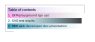

# gfm-playground

Testing how text, images, and other elements are actually rendered into HTML from Markdown is important when crafting a non-trivial `README.md`. For this purpose, I (Bryce Carson) created an SVG image from a GNU logogram using a typographic template in Inkscape. The SVG file, as created, serves as a success-case for the following tests. The test image, `drawing.svg`, is rendered at half the original size using GitHub-permitted in-line CSS styles (``).

<div align="center"></div>

The rectangles were used to split the image into different parts, based on the x-height (the grey rectangle above the auburn and below the magenta).

<div align="center"></div>

It is barely discernible, but you can see a very small rendering issue where the paths composing the two horns were divided using the magenta rectangle. The rendering issue is due to the browser, and may not appear in other browsers (I am running Google Chrome `Version 100.0.4896.127 (Official Build) (64-bit)` on Fedora 36 Beta).

Although this rendering issue exists it is not part of the SVG image.

# Tests
1. Does the image render as it was drawn?<br><div align="center"></div>

2. Can the image be reassembled after splitting it along the guide-lines? How large is the padding on different displays? Alignment divs with `margin-{top,bottom}:0;` are set.<br>The canvas size is adjusted to each remainder in the image after path division; the canvases, placed atop each other, should add up to 1000 pixels.

<div style="margin-top:0;margin-bottom:0;">


</div>

The three rendered images are not placed directly after one another. How does this compare to standard HTML rendering?

With added margin-top and -bottom of zero, the padding between the image elements is less in the rendered README.

Using a measurement tool in the GNU IMP, on a desktop display of 1920x1080 pixels the vertical gap is seven pixels (7px) and on my phone display of 1440 × 3040 pixels the vertical gap is twenty-four pixels (24px).

3. Can the images be vertically joined in standard HTML?<br>

---

# SVG `<a>` element

The SVG standard also includes a linking element, so a visual object can link to another resource just like an HTML anchor.

```html
<svg viewBox="0 0 300 120" xmlns="http://www.w3.org/2000/svg">
  <a href="https://developer.mozilla.org" target="_self">
    <text x="0" y="20">Open link within iframe</text>
  </a>
</svg>
```

On GitHub.dev, the GitHub web editor, this linking works in the preview. It's only going to be useful if it also work in normal GitHub README renders.

## Tests
1. Does the linking work if the SVG is included in the document using an `img` tag?<br>
2. Does the linking work if the SVG is included *as* an HTML tag?<br>
<svg
   width="95.023087mm"
   height="42.196743mm"
   viewBox="0 0 95.023087 42.196743"
   version="1.1"
   id="svg77829"
   xmlns:xlink="http://www.w3.org/1999/xlink"
   xmlns="http://www.w3.org/2000/svg"
   xmlns:svg="http://www.w3.org/2000/svg">
  <defs
     id="defs77826">
    <linearGradient
       id="ej"
       x1="4.2526999"
       x2="81.904999"
       y1="6002.2998"
       y2="6002.2998"
       gradientTransform="matrix(0.96099311,0,0,0.07017544,63.410106,-264.56926)"
       gradientUnits="userSpaceOnUse">
      <stop
         stop-color="#0082ab"
         offset="0"
         id="stop1645" />
      <stop
         stop-color="#0082ab"
         stop-opacity=".5"
         offset=".35"
         id="stop1647" />
      <stop
         stop-color="#0082ab"
         stop-opacity=".22"
         offset=".63"
         id="stop1649" />
      <stop
         stop-color="#0082ab"
         stop-opacity="0"
         offset="1"
         id="stop1651" />
    </linearGradient>
    <linearGradient
       id="ek"
       x1="4.2526999"
       x2="81.904999"
       y1="5885.7998"
       y2="5885.7998"
       gradientTransform="matrix(0.96099311,0,0,0.07017544,63.410106,-264.56926)"
       gradientUnits="userSpaceOnUse">
      <stop
         stop-color="#0082ab"
         stop-opacity="0"
         offset="0"
         id="stop1640" />
      <stop
         offset="1"
         id="stop1642" />
    </linearGradient>
    <linearGradient
       id="el"
       x1="4.2526999"
       x2="81.904999"
       y1="5808.1001"
       y2="5808.1001"
       gradientTransform="matrix(0.96099311,0,0,0.07017544,63.410106,-264.56926)"
       gradientUnits="userSpaceOnUse">
      <stop
         stop-color="#ff2ee1"
         stop-opacity=".52923"
         offset="0"
         id="stop1635" />
      <stop
         stop-opacity="0"
         offset="1"
         id="stop1637" />
    </linearGradient>
    <linearGradient
       id="em"
       x1="4.2526999"
       x2="81.904999"
       y1="5730.5"
       y2="5730.5"
       gradientTransform="matrix(3.6321,0,0,0.26523,-7.1906,-1511.4)"
       gradientUnits="userSpaceOnUse">
      <stop
         stop-color="#7d4ad2"
         stop-opacity=".5323"
         offset="0"
         id="stop1630" />
      <stop
         stop-color="#fff"
         stop-opacity="0"
         offset="1"
         id="stop1632" />
    </linearGradient>
    <rect
       x="28.256001"
       y="1517.8365"
       width="282.04001"
       height="20.5954"
       id="rect41610" />
    <rect
       x="28.256001"
       y="1538.432"
       width="282.04001"
       height="20.594999"
       id="rect56526" />
    <rect
       x="28.256001"
       y="1559.027"
       width="282.04001"
       height="20.596001"
       id="rect64734" />
    <rect
       x="28.256001"
       y="1579.623"
       width="282.04001"
       height="20.595001"
       id="rect71926" />
    <filter
       style="color-interpolation-filters:sRGB"
       id="filter80552"
       x="-0.096484888"
       y="-0.33032458"
       width="1.2733738"
       height="1.9359196">
      <feFlood
         flood-opacity="0.498039"
         flood-color="rgb(0,0,0)"
         result="flood"
         id="feFlood80542" />
      <feComposite
         in="flood"
         in2="SourceGraphic"
         operator="in"
         result="composite1"
         id="feComposite80544" />
      <feGaussianBlur
         in="composite1"
         stdDeviation="3"
         result="blur"
         id="feGaussianBlur80546" />
      <feOffset
         dx="6"
         dy="6"
         result="offset"
         id="feOffset80548" />
      <feComposite
         in="SourceGraphic"
         in2="offset"
         operator="over"
         result="composite2"
         id="feComposite80550" />
    </filter>
  </defs>
  <g
     id="layer1"
     transform="translate(-60.297017,-130.35417)">
    <rect
       x="65.377319"
       y="135.3866"
       width="79.245354"
       height="26.226822"
       fill="none"
       stroke="#000000"
       stroke-width="0.129408"
       id="rect1656" />
    <rect
       style="fill:#ffffff;stroke:none;stroke-width:0.1;stroke-miterlimit:4;stroke-dasharray:none;filter:url(#filter80552)"
       id="rect78144"
       width="74.623085"
       height="21.796743"
       x="67.497017"
       y="137.55417" />
    <a
       id="a80788">
      <g
         id="g78039">
        <a
           id="a2831"
           transform="matrix(0.26458333,0,0,0.26458333,60.020952,-264.0401)">
          <rect
             transform="translate(20,1509.4)"
             x="8.2559996"
             y="8.4365997"
             width="282.04001"
             height="20.594999"
             fill="url(#em)"
             fill-opacity="0.75"
             fill-rule="evenodd"
             id="rect1664"
             style="fill:url(#em)" />
        </a>
        <text
           xml:space="preserve"
           id="text41608"
           style="font-style:normal;font-variant:normal;font-weight:normal;font-stretch:normal;font-size:13.3333px;line-height:1.25;font-family:'agave Nerd Font Mono';-inkscape-font-specification:'agave Nerd Font Mono';text-align:start;white-space:pre;shape-inside:url(#rect41610)"
           x="-7.9115853e-07"
           y="0"
           transform="matrix(0.26458333,0,0,0.26458333,60.550119,-263.30664)"><tspan
             x="28.255859"
             y="1529.5026"
             id="tspan101584">Table of contents</tspan></text>
      </g>
    </a>
    <a
       id="a101409"
       xlink:href="gfm-playground">
      <g
         id="g101407">
        <rect
           x="67.497017"
           y="143.00336"
           width="74.623085"
           height="5.4490933"
           fill="url(#el)"
           fill-opacity="0.75"
           fill-rule="evenodd"
           id="rect1662"
           style="fill:url(#el);stroke-width:0.264583" />
        <text
           xml:space="preserve"
           id="text56524"
           style="font-style:normal;font-variant:normal;font-weight:normal;font-stretch:normal;font-size:10.6667px;line-height:1.25;font-family:'agave Nerd Font Mono';-inkscape-font-specification:'agave Nerd Font Mono';white-space:pre;shape-inside:url(#rect56526)"
           transform="matrix(0.26458333,0,0,0.26458333,60.550119,-262.85542)"><tspan
             x="28.255859"
             y="1547.765"
             id="tspan101586">1. GFM playground (go up)</tspan></text>
      </g>
    </a>
    <a
       id="a92237"
       xlink:href="results">
      <g
         id="g92224">
        <rect
           x="67.497017"
           y="148.45245"
           width="74.623085"
           height="5.4490933"
           fill="url(#ek)"
           fill-opacity="0.75"
           fill-rule="evenodd"
           id="rect1660"
           style="fill:url(#ek);stroke-width:0.264583" />
        <text
           xml:space="preserve"
           id="text64732"
           style="font-style:normal;font-variant:normal;font-weight:normal;font-stretch:normal;font-size:10.6667px;line-height:1.25;font-family:'agave Nerd Font Mono';-inkscape-font-specification:'agave Nerd Font Mono';white-space:pre;shape-inside:url(#rect64734)"
           transform="matrix(0.26458333,0,0,0.26458333,60.550119,-262.83137)"><tspan
             x="28.255859"
             y="1568.3607"
             id="tspan101588">2. SVG test results</tspan></text>
      </g>
    </a>
    <a
       id="a92243"
       xlink:href="https://developer.mozilla.org/en-US/">
      <g
         id="g92219">
        <rect
           x="67.497017"
           y="153.90181"
           width="74.623085"
           height="5.4490933"
           fill="url(#ej)"
           fill-opacity="0.75"
           fill-rule="evenodd"
           id="rect1658"
           style="fill:url(#ej);stroke-width:0.264583" />
        <text
           xml:space="preserve"
           id="text71924"
           style="font-style:normal;font-variant:normal;font-weight:normal;font-stretch:normal;font-size:10.6667px;line-height:1.25;font-family:'agave Nerd Font Mono';-inkscape-font-specification:'agave Nerd Font Mono';white-space:pre;shape-inside:url(#rect71926)"
           transform="matrix(0.26458333,0,0,0.26458333,60.550119,-262.85553)"><tspan
             x="28.255859"
             y="1588.9564"
             id="tspan101590">3. MDN web developer documentation</tspan></text>
      </g>
    </a>
  </g>
</svg>

## Results
- Only directly included SVG images with links work
- The directly included SVG image is not rendered in GitHub READMEs

## More Tests
1. Let's try an alternate SVG, one that is much smaller so we can navigate and work directly on its source code.

<html>
<div>
<?xml version="1.0" encoding="UTF-8" standalone="no"?>
<svg
   width="67.273727mm"
   height="68.492371mm"
   viewBox="0 0 67.273727 68.492371"
   version="1.1"
   id="svg101595"
   inkscape:version="1.1.2 (0a00cf5339, 2022-02-04)"
   sodipodi:docname="alternate-table-of-contents.svg"
   xmlns:inkscape="http://www.inkscape.org/namespaces/inkscape"
   xmlns:sodipodi="http://sodipodi.sourceforge.net/DTD/sodipodi-0.dtd"
   xmlns:xlink="http://www.w3.org/1999/xlink"
   xmlns="http://www.w3.org/2000/svg"
   xmlns:svg="http://www.w3.org/2000/svg">
  <sodipodi:namedview
     id="namedview101597"
     pagecolor="#ffffff"
     bordercolor="#666666"
     borderopacity="1.0"
     inkscape:pageshadow="2"
     inkscape:pageopacity="0.0"
     inkscape:pagecheckerboard="0"
     inkscape:document-units="mm"
     showgrid="false"
     inkscape:zoom="2.980935"
     inkscape:cx="122.4448"
     inkscape:cy="124.12213"
     inkscape:window-width="1920"
     inkscape:window-height="1011"
     inkscape:window-x="0"
     inkscape:window-y="32"
     inkscape:window-maximized="1"
     inkscape:current-layer="layer1"
     fit-margin-top="0"
     fit-margin-left="0"
     fit-margin-right="0"
     fit-margin-bottom="0" />
  <defs
     id="defs101592" />
  <g
     inkscape:label="Layer 1"
     inkscape:groupmode="layer"
     id="layer1"
     transform="translate(-42.260917,-83.937757)">
    <path
       style="fill:none;stroke:#000000;stroke-width:5;stroke-linecap:butt;stroke-linejoin:miter;stroke-miterlimit:4;stroke-dasharray:none;stroke-opacity:1"
       d="m 44.760917,83.937757 v 65.992373 h 9.270195"
       id="path101689" />
    <text
       xml:space="preserve"
       style="font-size:2.82223px;line-height:1.25;font-family:sans-serif;stroke-width:0.264583"
       x="49.8573"
       y="86.517517"
       id="text104435"><tspan
         sodipodi:role="line"
         id="tspan104433"
         style="stroke-width:0.264583"
         x="49.8573"
         y="86.517517">Table of contents</tspan></text>
    <a
       id="a115293"
       xlink:href="http://www.readthefuckingmanual.com/">
      <text
         xml:space="preserve"
         style="font-size:3.97135px;line-height:1.25;font-family:sans-serif;fill:#483737;stroke:#a02c2c;stroke-width:0.372313"
         x="34.170681"
         y="150.8019"
         id="text108039"
         transform="scale(1.4071687,0.71064684)"><tspan
           sodipodi:role="line"
           id="tspan108037"
           style="fill:#483737;stroke:#a02c2c;stroke-width:0.372313"
           x="34.170681"
           y="150.8019">readTheFuckingManual</tspan></text>
    </a>
    <a
       id="a112343"
       xlink:href="https://www.google.com">
      <text
         xml:space="preserve"
         style="font-size:11.7635px;line-height:1.25;font-family:sans-serif;stroke-width:1.10282"
         x="143.8667"
         y="43.097137"
         id="text111313"
         transform="scale(0.36524766,2.7378683)"><tspan
           sodipodi:role="line"
           id="tspan111311"
           style="stroke-width:1.10282"
           x="143.8667"
           y="43.097137">GOOGLE</tspan></text>
    </a>
  </g>
</svg>
</div>
2. What about the MDN SVG `<a>` tag source example above? That *did* work...
<svg viewBox="0 0 300 120" xmlns="http://www.w3.org/2000/svg">
  <a href="https://developer.mozilla.org" target="_self">
    <text x="0" y="20">Open link within iframe</text>
  </a>
</svg>
</html>

2. Here is another SVG, taken from , that is included with the `img` tag, but uses the `foreign-object` SVG element to do some interesting animation even in GitHub READMEs.<br>